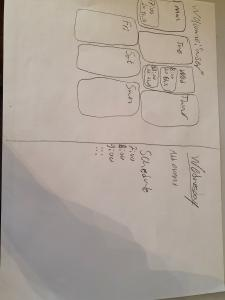

# Projektplan

## 1. Projektbeskrivning (Beskriv vad sidan ska kunna göra).
Jag ska bygga en hemsida där man kan sätta upp "events" samt tillhöra vissa grupper. Grupperna kan ha egna events som sköts av admins.
## 2. Vyer (visa bildskisser på dina sidor).

## 3. Databas med ER-diagram (Bild på ER-diagram).

## 4. Arkitektur (Beskriv filer och mappar - vad gör/innehåller de?).

